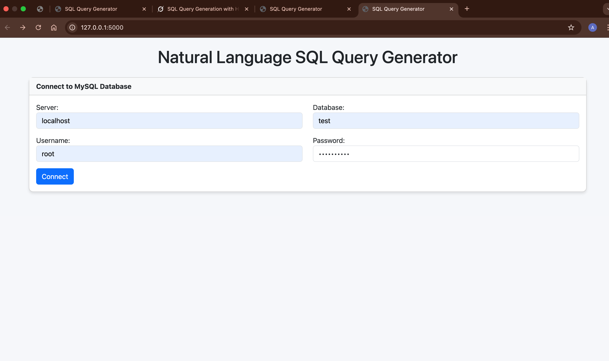
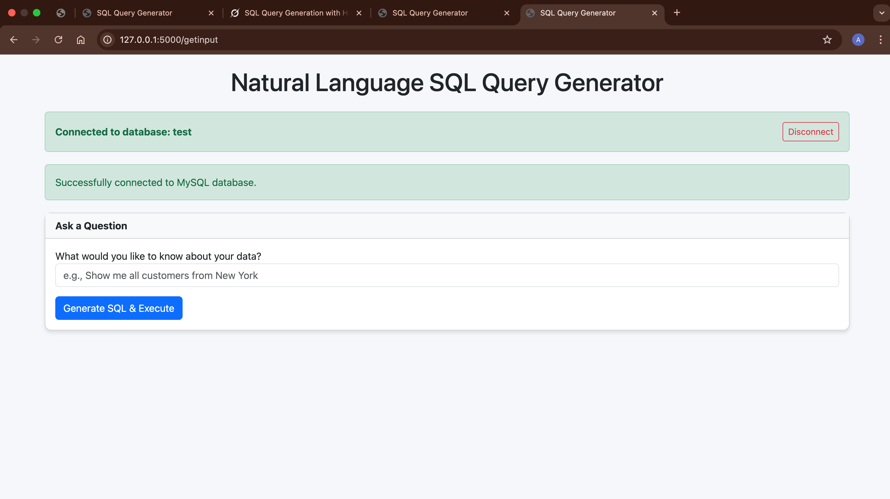

# Natural Language SQL Query Generator

This Flask web application allows users to connect to a MySQL database, input natural language questions, and generate SQL queries using the Hugging Face Inference API. The generated SQL queries are executed on the connected database, and the results are displayed in a user-friendly interface.

## Features

- Connect to a MySQL database using provided credentials.
- Input natural language questions about the data.
- Generate SQL queries using the Hugging Face model.
- Execute the generated SQL queries on the connected database.
- Display the query results in a tabular format.
- View the generated SQL query for verification.

## Prerequisites

- Python 3.x
- MySQL server
- Hugging Face account and API token
- Required Python packages:
    - Flask
    - pymysql
    - SQLAlchemy
    - requests
    - python-dotenv

## Installation

1. Clone the repository:
     ```bash
     git clone <repository_url>
     cd <repository_directory>
     ```

2. Install the required Python packages:
     ```bash
     pip install -r requirements.txt
     ```

3. Set up a virtual environment (optional but recommended):
     ```bash
     python -m venv venv
     source venv/bin/activate  # On Windows: venv\Scripts\activate
     ```

## Configuration

Create a `.env` file in the project root directory with the following variables:
```env
SECRET_KEY=your_flask_secret_key
HUGGINGFACE_API_TOKEN=your_huggingface_api_token
HUGGINGFACE_MODEL=mistralai/Mixtral-8x7B-Instruct-v0.1
```
Replace the placeholders with your actual values.

## Usage

1. Start the Flask server:
     ```bash
     python app.py
     ```

2. Access the web interface by navigating to [http://localhost:5000](http://localhost:5000) in your web browser.

3. Connect to your MySQL database:
     - Enter the server, database, username, and password in the connection form.
     - Click **Connect** to establish the connection.

4. Input a natural language query:
     - Once connected, enter a question about your data in the provided input field.
     - Click **Generate SQL & Execute** to generate and execute the SQL query.

5. View the results:
     - The generated SQL query will be displayed.
     - If the query is a `SELECT` statement, the results will be shown in a table.

## Troubleshooting

### Database connection errors:
- Ensure the MySQL server is running and accessible.
- Verify the connection credentials are correct.
- Check for any firewall or network issues.

### Hugging Face API issues:
- Confirm your API token is valid and has the necessary permissions.
- Ensure the specified model is correct and available.

### SQL query execution errors:
- Review the generated SQL query for syntax errors.
- Check if the query is compatible with your database schema.
- Verify that the database user has the required permissions.



