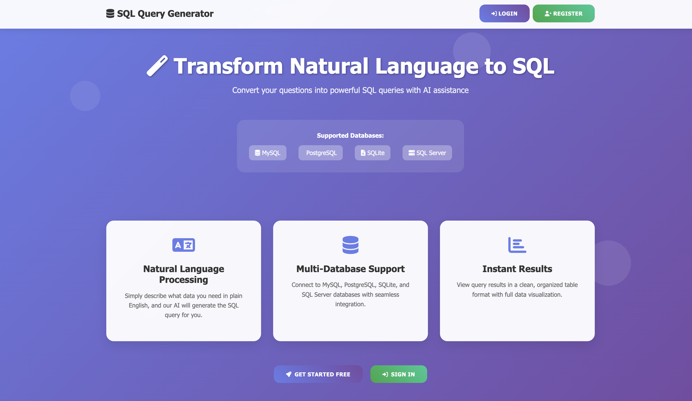
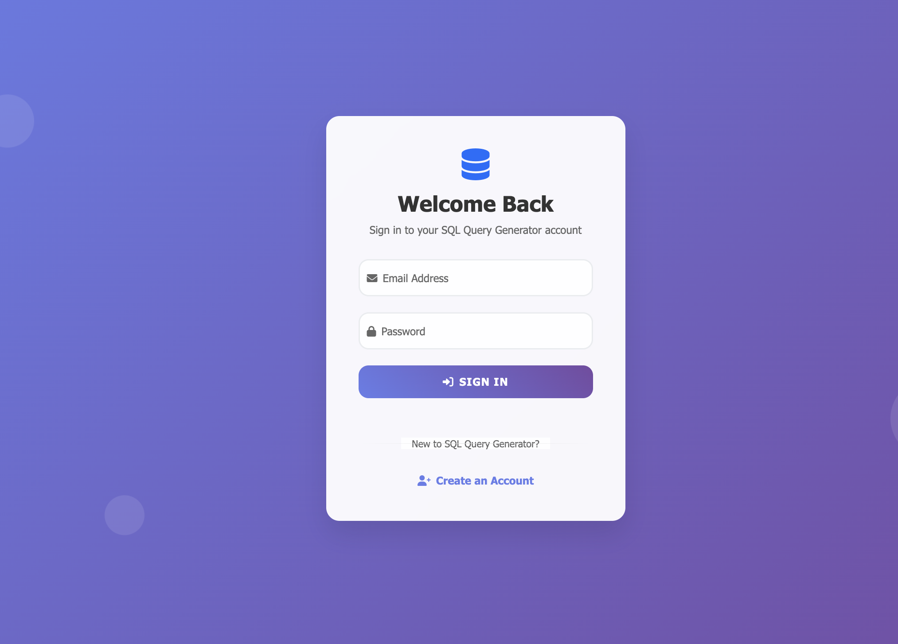
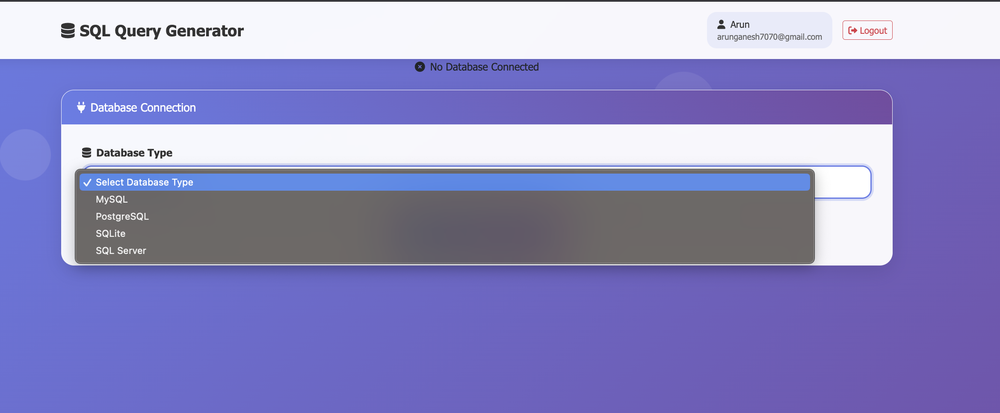
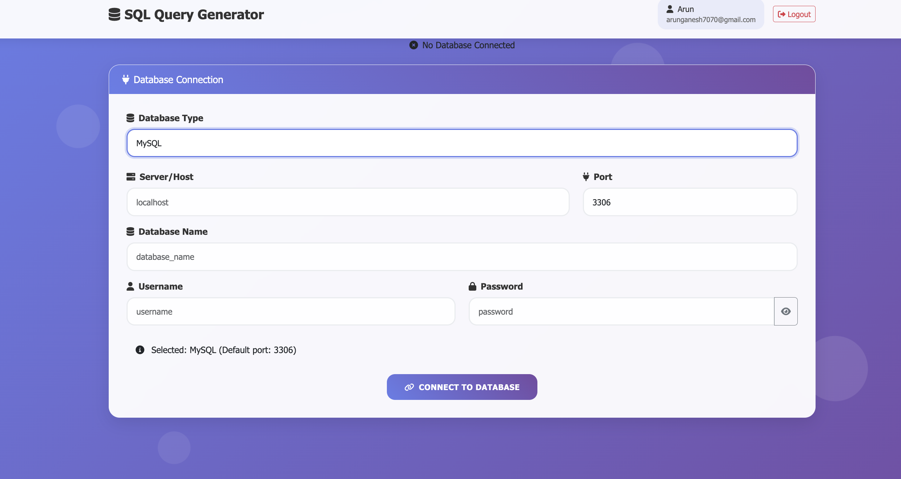
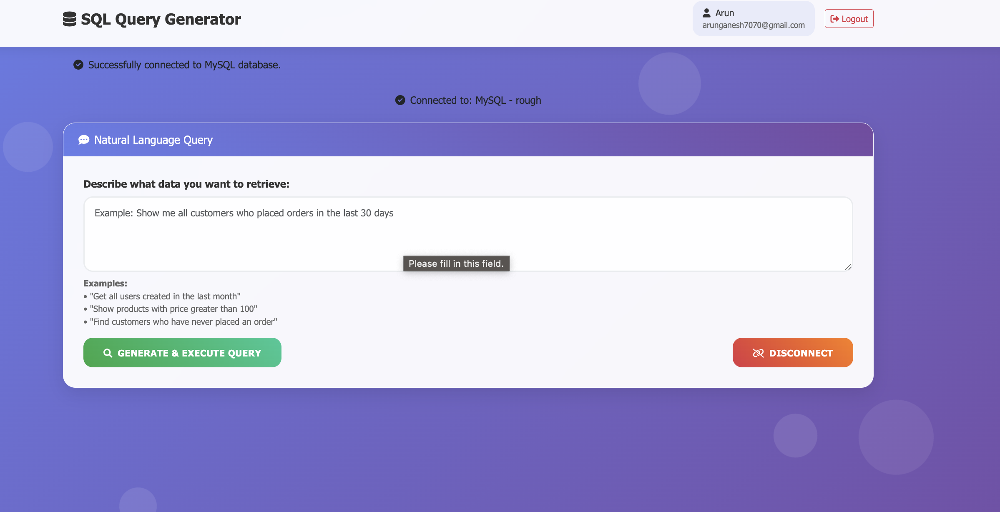

# 🗃️ Natural Language to SQL Database Interface

A powerful Flask web application that converts natural language queries into SQL statements and executes them across multiple database systems using AI-powered query generation.

## ✨ Features

### 🔐 Authentication & Authorization
- **User Registration & Login**: Secure user authentication with bcrypt password hashing
- **Role-Based Access Control (RBAC)**: Two user roles with different permissions
  - **Admin**: Full database access (SELECT, INSERT, UPDATE, DELETE)
  - **User**: Read-only access (SELECT queries only)
- **Session Management**: Secure session handling with automatic logout

### 🗄️ Multi-Database Support
- **MySQL**: Full support with optimized connection handling
- **PostgreSQL**: Complete PostgreSQL integration
- **SQLite**: Lightweight database support for local development
- **SQL Server**: Enterprise-grade SQL Server connectivity

### 🤖 AI-Powered Query Generation
- **Natural Language Processing**: Convert plain English to SQL using Groq's LLaMA model
- **Schema-Aware**: Automatically analyzes database structure for accurate query generation
- **Syntax Optimization**: Database-specific query optimization and formatting
- **Error Handling**: Intelligent error detection and user-friendly error messages

### 🛡️ Security Features
- **SQL Injection Protection**: SQLAlchemy parameterized queries
- **Input Validation**: Comprehensive input sanitization
- **Access Control**: Role-based query restrictions
- **Session Security**: Secure session management with encrypted cookies

### 🎨 User Interface
- **Responsive Design**: Mobile-friendly interface
- **Real-time Feedback**: Instant connection status and query results
- **Interactive Forms**: Dynamic database connection forms
- **Result Visualization**: Tabular display of query results

## 🚀 Quick Start

### Prerequisites
- Python 3.8+
- MongoDB (for user management)
- Database system(s) you want to connect to
- Groq API key

### Installation

1. **Clone the repository**
   ```bash
   git clone <repository-url>
   cd database-interface-app
   ```

2. **Create virtual environment**
   ```bash
   python -m venv venv
   source venv/bin/activate  # On Windows: venv\Scripts\activate
   ```

3. **Install dependencies**
   ```bash
   pip install -r requirements.txt
   ```

4. **Set up environment variables**
   Create a `.env` file in the root directory:
   ```env
   # Application Settings
   SECRET_KEY=your-secret-key-here
   
   # MongoDB Configuration
   MONGODB_URI=mongodb://localhost:27017/
   MONGODB_DATABASE=database_app
   
   # Groq API Configuration
   GROQ_API_KEY=your-groq-api-key-here
   ```

5. **Run the application**
   ```bash
   python app.py
   ```

6. **Access the application**
   Open your browser and navigate to `http://localhost:5000`

## 📋 Dependencies

### Core Framework
```
Flask==2.3.3
Flask-Bcrypt==1.0.1
```

### Database Drivers
```
pymongo==4.5.0
pymysql==1.1.0
psycopg2-binary==2.9.7
pyodbc==4.0.39
SQLAlchemy==2.0.21
```

### AI & NLP
```
langchain-groq==0.1.6
langchain==0.2.6
```

### Utilities
```
python-dotenv==1.0.0
```

## 🗂️ Project Structure

```
database-interface-app/
├── app.py                 # Main application file
├── requirements.txt       # Python dependencies
├── .env                  # Environment variables (create this)
├── templates/            # HTML templates
│   ├── index.html       # Main dashboard
│   ├── login.html       # Login page
│   └── register.html    # Registration page
├── static/              # Static assets
│   ├── css/            # Stylesheets
└── README.md           # This file
```

## 🔧 Configuration

### Database Connection Settings

The application supports multiple database types with specific configuration requirements:

#### MySQL
```python
DB_CONFIG = {
    'server': 'localhost',
    'port': 3306,
    'database': 'your_database',
    'username': 'your_username',
    'password': 'your_password'
}
```

#### PostgreSQL
```python
DB_CONFIG = {
    'server': 'localhost',
    'port': 5432,
    'database': 'your_database',
    'username': 'your_username',
    'password': 'your_password'
}
```

#### SQLite
```python
DB_CONFIG = {
    'database_path': '/path/to/your/database.db'
}
```

#### SQL Server
```python
DB_CONFIG = {
    'server': 'localhost',
    'port': 1433,
    'database': 'your_database',
    'username': 'your_username',
    'password': 'your_password'
}
```

### Groq API Setup

1. Sign up at [Groq Console](https://console.groq.com/)
2. Create an API key
3. Add the key to your `.env` file
4. The application uses the `llama3-70b-8192` model for query generation

## 🎯 Usage Guide

### User Registration
1. Navigate to `/register`
2. Fill in your details
3. Select your role (Admin or User)
4. Click "Register"

### Database Connection
1. Log in to your account
2. Select your database type
3. Enter connection details
4. Click "Connect"

### Natural Language Queries
Once connected, you can enter natural language queries such as:

**Example Queries:**
- "Show me all users"
- "Find customers from New York"
- "Count the number of orders this month"
- "Update user email where id is 5" (Admin only)
- "Delete inactive users" (Admin only)

### Query Results
- Results are displayed in a formatted table
- Generated SQL queries are shown for transparency
- Error messages provide helpful debugging information

## 🔐 Security Considerations

### Authentication
- Passwords are hashed using bcrypt
- Session tokens are securely generated
- Automatic session expiration

### Database Security
- Parameterized queries prevent SQL injection
- Connection strings are encrypted
- Database credentials are not logged

### Access Control
- Role-based permissions enforce data access policies
- User role restrictions prevent unauthorized modifications
- Admin oversight for sensitive operations

## 🐛 Troubleshooting

### Common Issues

**Connection Errors**
- Verify database credentials
- Check network connectivity
- Ensure database server is running

**Query Generation Errors**
- Verify Groq API key is valid
- Check natural language query clarity
- Ensure database schema is accessible

**Permission Errors**
- Verify user role permissions
- Check database user privileges
- Confirm table access rights


## 🤝 Contributing

1. Fork the repository
2. Create a feature branch (`git checkout -b feature/amazing-feature`)
3. Commit your changes (`git commit -m 'Add amazing feature'`)
4. Push to the branch (`git push origin feature/amazing-feature`)
5. Open a Pull Request


---

## 🚀 Future Enhancements

1. Verify the users mail sending otp
2. Forgot password
3. Report Generation 
4. Query Optimization

---
##Sample output
     